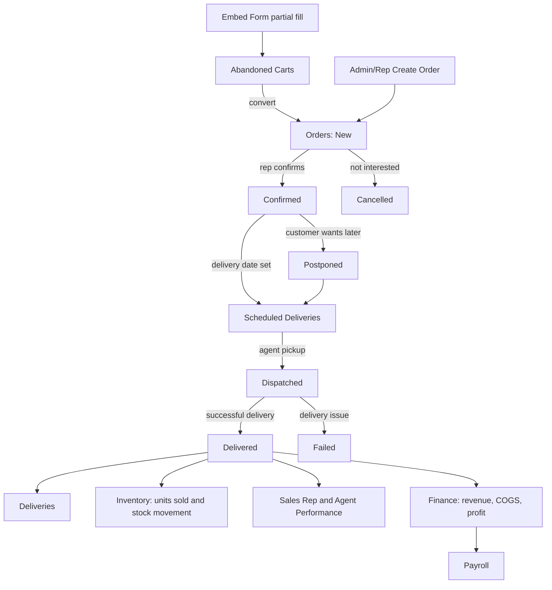

# Ordello CRM Calculation Workflow Audit

Observed against the live Ordello demo on 2026-05-04 and mirrored into this local CRM prototype.

This document has two jobs:

1. Record what the live Ordello pages expose: routes, KPIs, fields, filters, and calculation behavior.
2. Explain how to reproduce every major calculation locally with deterministic demo data.

No live Ordello records were modified during this audit. The local prototype now has a safe local-only button called **Load Calculation Demo** on the Administrator Dashboard.

## Blueprint Gap Check - 2026-05-05

Implemented/covered locally after comparing the complete admin blueprint:

- Full admin hash-route aliases for `/dashboard/admin/...`.
- `/dashboard/admin/reports` opens Finance & Accounting.
- `/dashboard/admin/utm-tracking` opens Ad Tracking.
- `/dashboard/admin/users` opens User Management.
- `/dashboard/admin/embed` opens Embed Form Generator.
- `/dashboard/admin/sales-teams` now exists as a Sales Teams page.
- `/dashboard/admin/orders/{id}` opens the full owner-access order-detail workflow, reusing the sales-rep order detail surface so admin has the same status, notes, scheduling, agent assignment, invoice, and edit controls.
- Admin navigation now includes Sales Teams and stays focused on personal-use operational modules.
- Embed Form now matches the live two-tab structure: Create Order Form for global form settings and Generate for per-product embed URLs/codes.
- Sales Reps table now separates Name, Email, Role, Status, Orders, Delivered, Conversion, Revenue, and Actions.

Still lighter than the full production blueprint:

- Sales Teams is currently a local scaffold derived from reps/products; it does not persist custom teams yet.
- Customer profile route is not a full profile page yet; customer routes currently focus/filter the Customers page.
- Payroll does not yet include a configurable "best rep bonus" field.
- Finance & Accounting is implemented locally, but the live Ordello route guesses returned 404 during the earlier audit.

## How To Replicate Locally

1. Start the local app:

```bash
npm run dev
```

2. Open:

```text
http://127.0.0.1:5173/#/dashboard
```

3. On **Administrator Dashboard**, click **Load Calculation Demo**.

4. Keep Dashboard on **Today** to match the live money-flow baseline:

```text
Revenue:     26500
COGS:         2500
Gross Profit: 24000
Expenses:     5000
Net Profit:  19000
```

5. Use **This Month** on Orders, Deliveries, Expenses, Finance, Customers, and Sales Reps to exercise the wider dataset.

The button resets local state and localStorage data for products, orders, carts, expenses, agents, users, payroll, and stock movement history.

## Live Route Map

Observed working live admin routes:

- `/dashboard/admin`
- `/dashboard/admin/orders`
- `/dashboard/admin/abandoned-carts`
- `/dashboard/admin/scheduled-deliveries`
- `/dashboard/admin/deliveries`
- `/dashboard/admin/inventory`
- `/dashboard/admin/inventory/history`
- `/dashboard/admin/sales-reps`
- `/dashboard/admin/agents`
- `/dashboard/admin/payroll`
- `/dashboard/admin/customers`
- `/dashboard/admin/expenses`
- `/dashboard/admin/utm-tracking`
- `/dashboard/admin/users`
- `/dashboard/admin/round-robin`
- `/dashboard/admin/ai-tokens`
- `/dashboard/admin/notifications`
- `/dashboard/admin/settings`

Observed 404 routes:

- `/dashboard/admin/finance`
- `/dashboard/admin/finance-accounting`
- `/dashboard/admin/finance-and-accounting`
- `/dashboard/admin/ad-tracking`
- `/dashboard/admin/embed-form`

Local prototype still keeps **Finance & Accounting**, **Ad Tracking**, and **Embed Form** as local modules because they are part of our target build.

## Demo Dataset

### Products

| Product | Unit Cost | Selling Price | Warehouse | Agent Stock | Units Sold |
|---|---:|---:|---:|---:|---:|
| Edge Brusher Max | 500 | 5500 | 70 | 30 | 5 |
| Demo Audit Blender | 4000 | 12000 | 30 | 10 | 2 |
| Multiple Hanger | 2000 | 6125 | 70 | 30 | 0 |

Packages:

- Edge Brusher Max: Single Pack = 5500, 5 Unit Delivery Pack = 26500.
- Demo Audit Blender: DEMO STARTER PACK = 24000.
- Multiple Hanger: Single Hanger = 6125, Double Hanger = 12250.

### Orders

| Order | Status | Product | Qty | Amount | Created | Delivered/Scheduled |
|---|---|---|---:|---:|---|---|
| ORD-2001 | Delivered | Edge Brusher Max | 5 | 26500 | Today | Delivered today |
| ORD-2002 | New | Demo Audit Blender | 2 | 24000 | Today | none |
| ORD-2003 | Confirmed | Edge Brusher Max | 1 | 5500 | Today | Scheduled today |
| ORD-2004 | Dispatched | Multiple Hanger | 2 | 12250 | Today | Scheduled tomorrow |
| ORD-2005 | Postponed | Demo Audit Blender | 2 | 24000 | Today | Scheduled next tomorrow |
| ORD-2006 | Cancelled | Edge Brusher Max | 1 | 5500 | Today | none |
| ORD-2007 | Failed | Multiple Hanger | 1 | 6125 | Today | none |
| ORD-2008 | Delivered | Demo Audit Blender | 2 | 24000 | Yesterday | Delivered yesterday |

### Expenses

| Expense | Type | Amount | Date | Product Link |
|---|---|---:|---|---|
| EXP-2001 | Ad Spend | 5000 | Today | General |
| EXP-2002 | Waybill | 2000 | Yesterday | Demo Audit Blender |

### Carts

| Cart | Status | Assigned? | Converts? |
|---|---|---|---|
| CART-2001 | Open abandoned | No | No |
| CART-2002 | Assigned | Yes | No |
| CART-2003 | Contacted | Yes | No |
| CART-2004 | Converted | Yes | Yes |

### Agents

| Agent | Stock | Defective | Missing |
|---|---:|---:|---:|
| Demo Agent Mainland | 10 Demo Audit Blender | 1 Demo Audit Blender | 0 |
| Lagos Agent | 30 Edge Brusher + 30 Multiple Hanger | 0 | 1 Multiple Hanger |

### Pay Structures

| User | Structure | Formula |
|---|---|---|
| busy bright | Fixed + Commission | 15000 + 1000 per delivered order |
| Chelsea | Commission | 500 per delivered order |
| Demo Rep Alpha | Fixed + Commission | 20000 + 300 per delivered order |

## Core Formulas

| Metric | Formula |
|---|---|
| Revenue | Sum(order amount) where status = Delivered |
| COGS | Sum(product unit cost x delivered quantity) where status = Delivered |
| Gross Profit | Revenue - COGS |
| Net Profit | Gross Profit - expenses |
| Gross Margin | Gross Profit / Revenue |
| Net Margin | Net Profit / Revenue |
| Fulfillment Rate | Delivered orders / total orders |
| Cancellation Rate | Cancelled orders / total orders |
| Cart Conversion Rate | Converted carts / all carts |
| Inventory Value | Sum((warehouse stock + agent stock) x selling price) |
| Distribution Rate | Agent stock units / total stock units |
| Agent Success Rate | Delivered assigned orders / all assigned orders |
| Payroll Commission | Delivered order count x configured commission |
| Finance ROI | Net Profit / (COGS + expenses) |
| ROAS | Revenue / expenses |
| Avg CPA | Expenses / delivered order count |

## Page-By-Page Audit

### Dashboard

Purpose: executive command center for revenue, profit, order count, fulfillment, cart follow-up, and opportunity simulation.

Live baseline observed:

- Total Revenue: 26500
- Net Profit: 19000
- Total Orders: 2
- Fulfillment Rate: 50%
- Current Conversion: 50%
- Current Revenue: 26500

Local demo on **Today**:

- Total Revenue = 26500 from ORD-2001 only.
- COGS = 5 Edge Brusher units x 500 = 2500.
- Gross Profit = 26500 - 2500 = 24000.
- Expenses = 5000 from EXP-2001.
- Net Profit = 24000 - 5000 = 19000.
- Total Orders = 7 orders created today.
- Fulfillment Rate = 1 delivered / 7 today orders = 14.3%, displayed as 14%.
- Cancellation Rate = 1 cancelled / 7 today orders = 14%.
- Gross Margin = 24000 / 26500 = 91%.
- Net Margin = 19000 / 26500 = 72%.

Abandoned-cart widget:

- Total = 4.
- Active = Open abandoned + In progress + Abandoned + Assigned = 2.
- Contacted = Contacted + Converted + No response + Not interested = 2.
- Needs attention = Open abandoned + Abandoned + No response = 1.
- Converted = 1.

Replication checks:

- Switch Dashboard to **Today**.
- Open **Dashboard Math Rules** and confirm:
  - Gross Profit: 26500 - 2500 = 24000.
  - Net Profit: 24000 - 5000 = 19000.
- Click +10pp in the simulator to verify projected revenue uses:
  - current revenue per delivered order = revenue / delivered count.
  - target delivered = total orders x target conversion.

### Orders

Purpose: operational hub for all customer orders, statuses, reps, products, source, and actions.

Live observed:

- KPIs: Total Handled, Delivery Rate, Revenue Generated.
- Simulator: Orders Revenue Opportunity.
- Product breakdown: New Orders by Product.
- Search: order number, name, phone.
- Filters: status, source, location, date period, custom range.
- Actions: WhatsApp, Details, Edit, Delete.

Local demo on **This Month**:

- Total Handled = 8.
- Delivered = 2.
- Delivery Rate = 2 / 8 = 25%.
- Failed/Cancelled rate = (Cancelled + Failed) / 8 = 25%.
- Revenue Generated = ORD-2001 26500 + ORD-2008 24000 = 50500.

Product breakdown:

- Edge Brusher Max = 3 orders, 37500 total order value.
- Demo Audit Blender = 3 orders, 72000 total order value.
- Multiple Hanger = 2 orders, 18375 total order value.

State lifecycle:

```text
New -> Confirmed -> In Process -> Dispatched -> Delivered
                              -> Postponed
                              -> Cancelled
                              -> Failed
```

Replication checks:

- Set Orders period to **This Month**.
- Filter status = Delivered: expect ORD-2001 and ORD-2008.
- Filter status = Cancelled: expect ORD-2006.
- Filter status = Failed: expect ORD-2007.
- Details modal should show customer info, product/package, assigned rep, agent, amount, and timeline notes.

### Abandoned Carts

Purpose: recovery queue for partial/abandoned form leads.

Live observed with the current live demo:

- No abandoned leads were present.
- KPIs still exist: Open carts, Assigned, Contacted, Conversion rate.
- Search and status filter exist.

Local demo:

- Total carts = 4.
- Open carts = Open abandoned + Abandoned + In progress = 1.
- Assigned = 3.
- Contacted = Contacted + Converted + No response + Not interested = 2.
- Converted = 1.
- Conversion rate = 1 / 4 = 25%.
- Lost = 0.

Replication checks:

- Search `Kemi`: shows CART-2001.
- Filter `Contacted`: shows CART-2003.
- Filter `Converted`: shows CART-2004.
- Convert action should create a full order and mark the cart converted.

### Scheduled Deliveries

Purpose: read-only schedule view for committed delivery dates.

Live observed:

- Tabs: Today, Tomorrow, Next tomorrow.
- No create modal.

Local demo:

- Today = ORD-2003, status Confirmed.
- Tomorrow = ORD-2004, status Dispatched.
- Next tomorrow = ORD-2005, status Postponed.

Replication checks:

- On Today tab, confirm ORD-2003 appears.
- On Tomorrow tab, confirm ORD-2004 appears.
- On Next tomorrow tab, confirm ORD-2005 appears.
- Change an order status to Delivered and it should leave this queue and appear in Deliveries.

### Deliveries

Purpose: archive of fulfilled orders, anchored to delivered date.

Live observed:

- Total Delivered: 1.
- Total Revenue: 26500.
- Avg Fulfillment: 0.1 days.
- Avg Per Day: 0.3 orders.

Local demo on **This Month**:

- Delivered orders = ORD-2001 and ORD-2008 = 2.
- Total Revenue = 50500.
- Avg Fulfillment = average(delivered date - created date). Both seeded delivered same day, so 0.0 days.
- Avg Per Day = delivered count / days elapsed in period. On 2026-05-04, 2 / 4 = 0.5 orders/day.

Replication checks:

- Filter by Lagos Agent: expect ORD-2001.
- Filter by Demo Agent Mainland: expect ORD-2008.
- Search Adaeze: expect ORD-2001.

### Inventory Dashboard

Purpose: control product stock across warehouse and delivery agents.

Live observed:

- Total Inventory Value: 1642500.
- Total Units in Stock: 240.
- Active Agents: 2.
- Distribution Rate: 29%.
- Product columns: Product Details, SKU, Unit Cost, Selling Price, Global Balance, Agent Balance, Units Sold, Actions.
- Row actions: Details, Pricing, Packages.
- Stock History route: `/dashboard/admin/inventory/history`.

Local demo after alignment:

- Total Inventory Value uses selling price:
  - Edge Brusher Max: (70 + 30) x 5500 = 550000.
  - Demo Audit Blender: (30 + 10) x 12000 = 480000.
  - Multiple Hanger: (70 + 30) x 6125 = 612500.
  - Total = 1642500.
- Total Units = 100 + 40 + 100 = 240.
- Agent Stock Units = 30 + 10 + 30 = 70.
- Distribution Rate = 70 / 240 = 29%.
- Active Agents = 2.

Stock History demo records:

- Distributed to Agent.
- Order Fulfilled.
- Correction.
- Return.

Replication checks:

- Inventory Dashboard should show 1642500 value, 240 units, 2 active agents, 29% distribution.
- Open Stock History and filter by type to confirm movement audit rows.

### Sales Representatives

Purpose: manage reps and compare conversion/revenue performance.

Live observed:

- KPIs: Total Reps, Active Reps, Total Orders, Avg Conversion.
- Leaderboard ranks by revenue and conversion.
- Columns: Name, Status, Orders, Delivered, Conversion, Revenue, Actions.

Local demo on **This Month**:

- Total Reps = 2.
- Active Reps = 2.
- Total Orders = 8.
- Chelsea: 3 assigned, 1 delivered, 33% conversion, 26500 revenue.
- Demo Rep Alpha: 5 assigned, 1 delivered, 20% conversion, 24000 revenue.
- Avg Conversion is the average of rep conversion rates: round((33 + 20) / 2) = 27%.

Replication checks:

- Open Chelsea profile: recent orders should include ORD-2001, ORD-2004, ORD-2007.
- Open Demo Rep Alpha profile: recent orders should include ORD-2002, ORD-2003, ORD-2005, ORD-2006, ORD-2008.

### Agents

Purpose: delivery-agent directory, stock accountability, pending delivery visibility, and performance.

Live observed:

- KPIs: Total Agents, Active on Duty, Stock with Agents, Pending Deliveries, Defective Stock Value, Missing Stock Value.
- Columns: Agent Details, Primary Zone, Status, Success Rate, Stock Value, Actions.

Local demo:

- Total Agents = 2.
- Active on Duty = 2.
- Stock with Agents = 468750:
  - Demo Agent Mainland: 10 x 12000 = 120000.
  - Lagos Agent: (30 x 5500) + (30 x 6125) = 348750.
- Pending Deliveries = 2: ORD-2003 and ORD-2004.
- Defective Stock Value = 1 Demo Audit Blender x 12000 = 12000.
- Missing Stock Value = 1 Multiple Hanger x 6125 = 6125.
- Lagos Agent success rate = 1 delivered / 4 assigned = 25%.
- Demo Agent Mainland success rate = 1 delivered / 1 assigned = 100%.

Replication checks:

- Filter zone Lagos Island: expect Lagos Agent.
- Filter status Order in Progress: expect Lagos Agent.
- Open Assign Stock and Reconcile Stock to see stock movement effects.

### Payroll

Purpose: configure salary/commission and preview/save payroll runs.

Live observed:

- Pay Rates tab shows users and pay structures.
- Commission can be stored per delivered order.

Local demo:

- Owner: 15000 fixed + 1000 x 2 delivered = 17000.
- Chelsea: 500 x 1 delivered = 500.
- Demo Rep Alpha: 20000 fixed + 300 x 1 delivered = 20300.
- Payroll preview total = 37800.

Replication checks:

- Open Payroll.
- Pay Rates should show configured structures for owner, Chelsea, and Demo Rep Alpha.
- Run Payroll preview for May 2026 and confirm total 37800.

### Customers

Purpose: customer directory built from order history.

Live observed:

- KPIs: Total Customers, Active Customers, Returning Rate, Avg Lifetime Value.
- Columns: Customer, Contact Details, Orders, Source, Successful, Cancelled, Total Spend, Reliability, Actions.

Local demo on **This Month**:

- Total Customers = 8 unique customer/contact keys.
- Active Customers = 8.
- Returning Rate = 0%, because each demo customer appears once.
- Avg Lifetime Value = delivered revenue / customer count = 50500 / 8 = 6313.
- Total Spend only counts Delivered orders.

Replication checks:

- Search Adaeze: total spend 26500, successful 1.
- Search Demo Customer One: total spend 0 because status is New.

### Expenses

Purpose: operational cost tracking and profit impact.

Live observed:

- Total Expenses: 5000.
- Product-Linked: 0.
- General Expenses: 5000.
- Profit Impact:
  - Gross Revenue 26500.
  - COGS 2500.
  - Expenses 5000.
  - Net Profit 19000.
  - COGS 9%, Operating Expenses 19%, Profit Margin 72%.

Local demo:

- Today:
  - Total Expenses = 5000.
  - General = 5000.
  - Product-linked = 0.
  - Net Profit impact matches dashboard: 19000.
- This Month:
  - Total Expenses = 7000.
  - General = 5000.
  - Product-linked = 2000.
  - Revenue = 50500.
  - COGS = 10500.
  - Net Profit = 50500 - 10500 - 7000 = 33000.

Replication checks:

- Filter by Ad Spend: shows EXP-2001.
- Filter by Waybill: shows EXP-2002.
- Search Demo Audit Blender: shows product-linked expense.

### Finance & Accounting

Purpose: full profitability view across revenue, COGS, expenses, reps, agents, P&L, and product profitability.

Live note: public route guesses for Finance returned 404 during this audit, but the calculation model is documented and implemented locally.

Local demo on **This Month**:

- Revenue = 50500.
- COGS = 10500.
- Gross Profit = 40000.
- Expenses = 7000.
- Net Profit = 33000.
- Gross Margin = 40000 / 50500 = 79.2%.
- Net Margin = 33000 / 50500 = 65.3%.
- Avg CPA = 7000 / 2 delivered = 3500.
- ROI = 33000 / (10500 + 7000) = 189%.
- ROAS = 50500 / 7000 = 7.21x.

Rep finance:

- Chelsea: revenue 26500, COGS 2500, allocated expenses 3500, net 20500.
- Demo Rep Alpha: revenue 24000, COGS 8000, allocated expenses 3500, net 12500.

Product profitability:

- Edge Brusher Max: revenue 26500, COGS 2500, expenses 0, net 24000, margin 91%, ROI 960%.
- Demo Audit Blender: revenue 24000, COGS 8000, expenses 2000, net 14000, margin 58%, ROI 140%.
- Multiple Hanger: no delivered revenue yet.

### Ad Tracking

Purpose: attribute orders to source/campaign/creative.

Live route: `/dashboard/admin/utm-tracking`.

Local demo:

- Orders carry `utmSource` and `utmCampaign`.
- Revenue attribution should only use delivered order value when reporting revenue outcomes.
- Non-delivered orders still show campaign pipeline volume.

Replication checks:

- Look for Facebook revenue from ORD-2001.
- Website/TikTok orders should show pipeline but only delivered TikTok ORD-2008 contributes revenue.

### User Management

Purpose: manage users, roles, active state, and permissions.

Live route: `/dashboard/admin/users`.

Local demo:

- Total Users = 4.
- Active Users = 4.
- Roles: Owner, 2 Sales Reps, 1 Inventory Manager.
- Role distribution should show Sales Reps as 50%, Owner/Admin as 25%, Inventory Manager as 25% depending on local grouping.

Replication checks:

- Filter Sales Rep: Chelsea and Demo Rep Alpha.
- Toggle a user inactive to see Active Users and Round-Robin availability change.

### Round-Robin

Purpose: determine who receives the next incoming order.

Live observed:

- Shows next in line.
- Active Sequence and Temporarily Excluded tabs.
- Explains that assigned reps move to the end of the queue and excluded reps are skipped.

Local demo:

- Chelsea open orders = 1.
- Demo Rep Alpha open orders = 3.
- Active sequence sorts by fewer open orders first, then name.
- Next in line should be Chelsea.

Replication checks:

- Toggle Demo Rep Alpha inactive in User Management, then return to Round-Robin.
- Alpha should move to Temporarily Excluded.

### Embed Form

Purpose: customer-facing order capture form and generated embeddable link/code.

Live note: `/dashboard/admin/embed-form` returned 404 during this audit, but the local module implements the flow.

Local replication:

- Pick a product/package.
- Fill customer details.
- If submitted fully, a new order is created and attributed by source/UTM.
- If partially filled and abandoned, an abandoned cart draft is created/updated.

Fields:

- Customer name.
- Phone.
- WhatsApp.
- Email toggle.
- Address/city/state.
- Product and package.
- Confirmation checkbox if enabled.
- Redirect URL and generated embed code.

### Call Rep Console

Purpose: owner-accessible version of the sales-rep workspace. The owner can see all reps while preserving rep-only workflow screens.

Local demo:

- Scope defaults to All reps.
- Revenue = all delivered assigned order revenue = 50500.
- Total Orders = 8.
- Pending New = 1.
- Confirmed = 1.
- Delivered This Month = 2.
- Conversion = 2 / 8 = 25%.
- Estimated Earnings = sum of rep pay for Chelsea and Alpha = 20800.

Key screens:

- Dashboard: assigned order KPIs and cart widget.
- Products: read-only product catalog.
- Orders: create/filter/export and detail links.
- Order Detail: customer info, items, status workflow, agent assignment, scheduling, notes, invoice print/download.
- Scheduled Deliveries: rep-scoped scheduled orders.
- Abandoned Carts: rep-scoped recovery queue.
- Customers: customer history for handled orders.
- Leaderboard: all reps ranked by revenue, delivered orders, and conversion.
- Notifications and Settings.

Replication checks:

- Open ORD-2001 detail to see a completed status timeline.
- Open ORD-2003 detail to schedule/assign/change status.
- Change status with a reason; it should append to Communication Timeline.

## Master Flow



## Relationship Map

- Products power order package choices.
- Orders update Sales Rep performance.
- Orders with scheduled dates feed Scheduled Deliveries.
- Delivered orders feed Deliveries, Finance, Customers, Sales Reps, Agents, and Payroll.
- Delivered order quantity and product cost drive COGS.
- Delivered order revenue minus COGS minus expenses drives Net Profit.
- Agent stock assignment updates Inventory and Stock History.
- Reconciliation updates defective/missing stock value.
- Abandoned carts convert into orders.
- Round-Robin decides which active rep receives incoming leads/orders.
- Embed Form creates orders or abandoned carts.
- UTM/source fields feed Ad Tracking.

## Important Implementation Notes

- Revenue never counts New, Confirmed, In Process, Dispatched, Postponed, Cancelled, or Failed orders.
- COGS only counts Delivered orders.
- Customer total spend only counts Delivered orders.
- Orders page product breakdown counts all orders in the selected period, not only delivered orders.
- Sales Rep average conversion is an unweighted average of individual rep conversion rates.
- Finance rep expenses are allocated by delivered order count share.
- Product profitability only deducts product-linked expenses from that product.
- Inventory value is selling price value, matching the live app.
- Agent issue value is selling price value of defective/missing stock.
- Dashboard default period is Today; most operational pages default to This Month.
